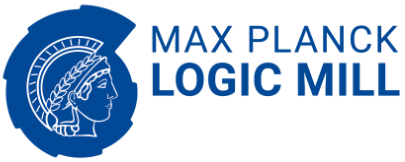

# Logic Mill - A Knowledge Navigation System

Logic Mill is a scalable and openly accessible software system that identifies semantically similar documents within either one domain-specific corpus or multi-domain corpora. It uses advanced Natural Language Processing (NLP) techniques to generate numerical representations of documents. Currently, it leverages a large pre-trained language model to generate these document representations. The system focuses on scientific publications and patent documents and contains more than 200 million documents. It is easily accessible via a simple Application Programming Interface (API) or via a web interface. Moreover, it is continuously being updated and can be extended to text corpora from other domains. We see this system as a general-purpose tool for future research applications in the social sciences and other domains.


This repository contains public documentation and code examples for the use of the API. This is also the place to post issues and feature requests.


# Waiting list
 
You can sign up for the [Logic Mill waiting list](https://logic-mill.net/waiting-list).
Signing up for the waiting list does not automatically give you access to the system.

# API key
In order to use the Logic Mill endpoint you need an API key. Check your profile (top right) once you are logged in and copy the key into your code.

# Examples

Examples are organised by **API endpoint**, with self-contained language subfolders:

| Endpoint | Python | R | Go | Stata |
|----------|--------|---|----|-------|
| [Documents](Documents/) | [Python](Documents/python/) | [R](Documents/R/) | | |
| [SimilaritySearch](SimilaritySearch/) | [Python](SimilaritySearch/python/) | [R](SimilaritySearch/R/) | | |
| [encodeDocument](encodeDocument/) | [Python](encodeDocument/python/) | [R](encodeDocument/R/) | [Go](encodeDocument/go/) | |
| [encodeDocuments](encodeDocuments/) | [Python](encodeDocuments/python/) | [R](encodeDocuments/R/) | | |
| [encodeDocumentAndSimilaritySearch](encodeDocumentAndSimilaritySearch/) | [Python](encodeDocumentAndSimilaritySearch/python/) | [R](encodeDocumentAndSimilaritySearch/R/) | | [Stata](encodeDocumentAndSimilaritySearch/Stata/) |
| [encodeDocumentAndSimilarityCalculation](encodeDocumentAndSimilarityCalculation/) | [Python](encodeDocumentAndSimilarityCalculation/python/) | [R](encodeDocumentAndSimilarityCalculation/R/) | | |
| [retrieveDocumentAndSimilarityCalculation](retrieveDocumentAndSimilarityCalculation/) | [Python](retrieveDocumentAndSimilarityCalculation/python/) | [R](retrieveDocumentAndSimilarityCalculation/R/) | | |

Each language folder has its own `README.md` with setup instructions and a link to the corresponding API documentation.

# Bug reports and feature requests

If you found an error in our API or have a request to improve our system, please let us know! You can add those as an issue in this GitHub repository:

[Create a request](https://github.com/max-planck-innovation-competition/logic-mill/issues/new/choose)

# URLs
- [Website](https://logic-mill.net/)
- [API endpoint](https://api.logic-mill.net/api/v1/graphql/)
- [API documentation](https://logic-mill.net/app/lm/explorer) 


# Paper

If you use the Logic Mill system, please cite our paper: <https://ceur-ws.org/Vol-3775/paper7.pdf>:

```
@inproceedings{erhardt2024,
  booktitle = {PatentSemTech@SIGIR},
  pages = {25-35},
  title = {Logic Mill - A Knowledge Navigation System},
  type = {conference},
  year = {2024},
  doi = {10.48550/arXiv.2301.00200},
  url = {https://ceur-ws.org/Vol-3775/paper7.pdf}
}

```

<!-- # Terms of use
 -->


# Contact
- Email: <team@logic-mill.net>
- [Homepage of Max Planck Institute for Innovation and Competition](https://www.ip.mpg.de/en/)
- [Imprint ](<https://www.ip.mpg.de/en/imprint/>)


© 2023 Max Planck Institute for Innovation and Competition. All rights reserved.
